# Luxonis OAK Camera Parameters for Isaac Sim

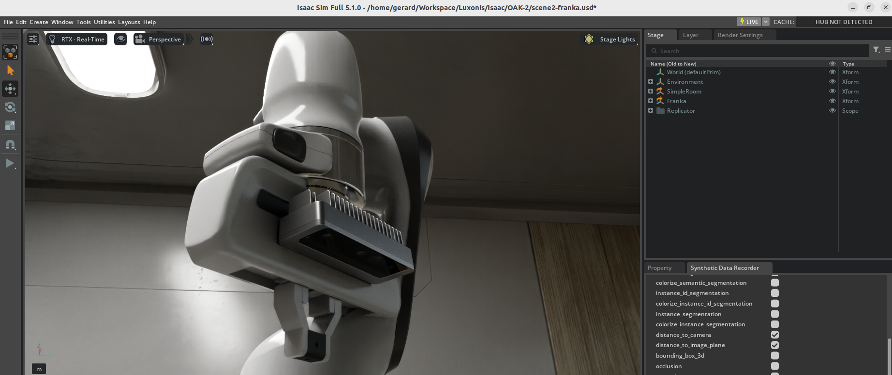

---

## 1. Overview

This document provides camera parameters for integrating Luxonis OAK depth cameras with NVIDIA Isaac Sim. Each camera model has its own section with nominal spec-sheet parameters and computed USD parameters.

[Download USD files](#download-links)

**Isaac Sim Version:** 5.1+

**Reference Documentation:**
- [Isaac Sim Camera Sensors](https://docs.isaacsim.omniverse.nvidia.com/5.1.0/sensors/isaacsim_sensors_camera.html)
- [Camera and Depth Sensor Assets](https://docs.isaacsim.omniverse.nvidia.com/5.1.0/assets/usd_assets_camera_depth_sensors.html)
- [Luxonis OAK Devices](https://docs.luxonis.com/hardware/)
- [Luxonis OAK Depth Accuracy](https://docs.luxonis.com/hardware/platform/depth/depth-accuracy/)
- [Luxonis Supported Sensors](https://docs.luxonis.com/hardware/platform/sensors/sensors/)
- [Luxonis Shop](https://shop.luxonis.com/)

### Camera Generations

This document covers two generations of Luxonis OAK depth cameras:

| Generation | Platform | Processor | Camera Models |
|------------|----------|-----------|---------------|
| **RVC2** | Myriad X (Intel) | VPU | OAK-D Pro PoE, OAK-D Pro W PoE, OAK-D ToF |
| **RVC4** | QCS8550 (Qualcomm) | AI SoC | OAK4-D, OAK4-D Wide |

The RVC4-based OAK4-D offers improved depth accuracy (~25% better at close range), a higher-resolution RGB sensor (IMX586), and significantly more onboard compute. All camera parameters are computed theoretically from nominal HFOV spec-sheet values using the formula `fx = width / (2 × tan(HFOV / 2))`, with centered principal points and symmetric left/right stereo cameras. To customize parameters for a specific device, see [Section 3.2: Device-Specific Calibration](#32-device-specific-calibration).

### Supported Camera Models

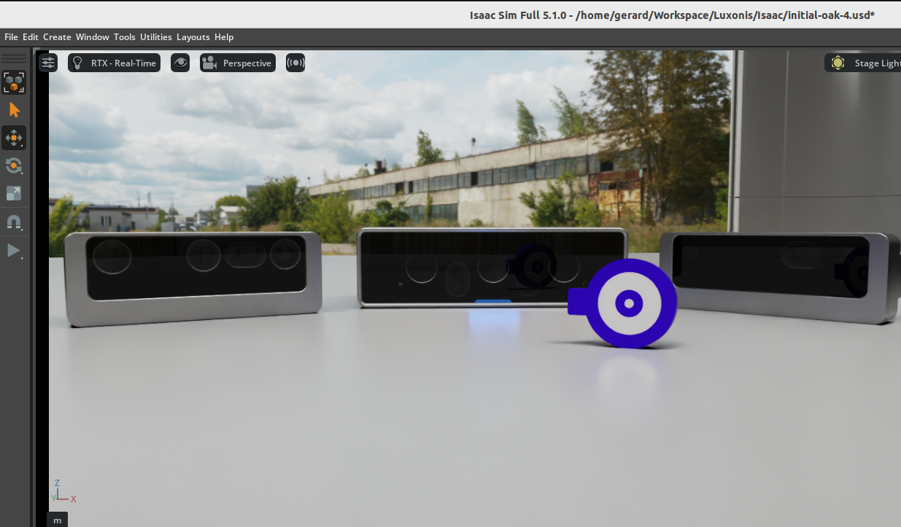
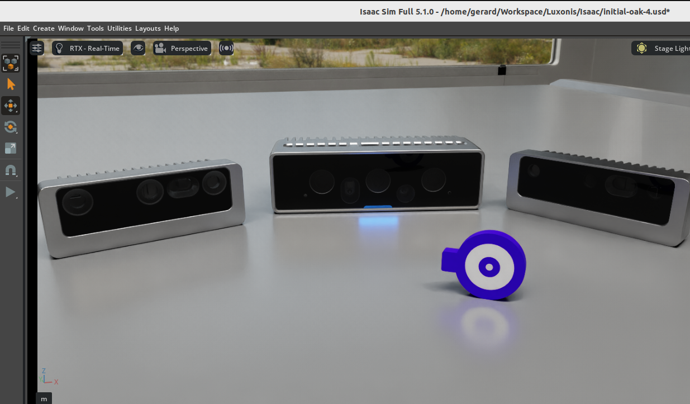
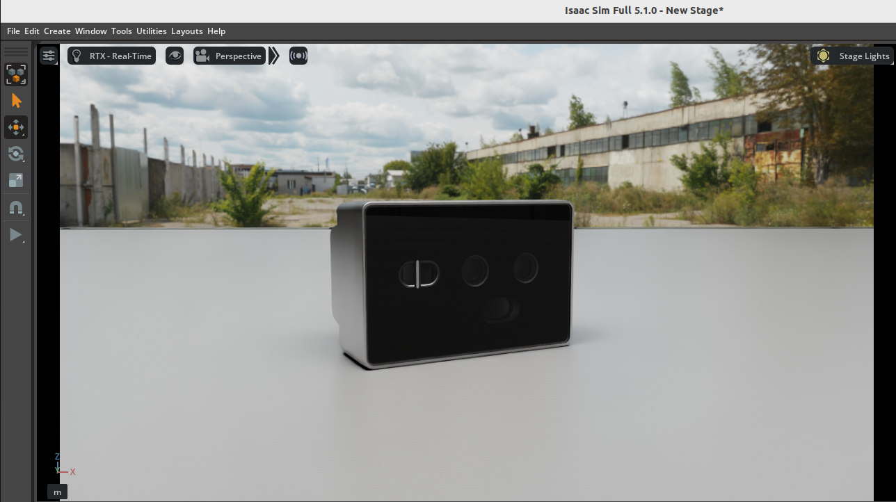

#### Download links

| Model | Generation | RGB HFOV | Stereo HFOV | USD Asset |
|-------|------------|----------|-------------|-----------|
| OAK-D Pro PoE | RVC2 | ~64° | ~77° | [Download](https://luxonis-isaac-sim.fra1.cdn.digitaloceanspaces.com/Luxonis.usd) |
| OAK-D Pro W PoE | RVC2 | ~80° | ~97° | [Download](https://luxonis-isaac-sim.fra1.cdn.digitaloceanspaces.com/oak_d_pro_w.usd) |
| OAK4-D | RVC4 | ~68° | ~77° | [Download](https://luxonis-isaac-sim.fra1.cdn.digitaloceanspaces.com/oak4_d.usd) |
| OAK4-D Wide | RVC4 | ~88° | ~97° | [Download](https://luxonis-isaac-sim.fra1.cdn.digitaloceanspaces.com/oak_d_pro_w.usd) |
| OAK-D ToF | RVC2 | ~70° (ToF) | ~80° | [Download](https://luxonis-isaac-sim.fra1.cdn.digitaloceanspaces.com/oak_tof.usd) |

---

Interested on any device? [Visit our shop](https://shop.luxonis.com/)

---

## 2. Sensor Specifications

OAK-D Pro (RVC2) variants use the same image sensors — the difference between standard and wide FOV models is in the optics (lenses), not the sensors. The OAK4-D (RVC4) uses a different RGB sensor (IMX586) but shares the same OV9282 stereo cameras. The OAK-D ToF (RVC2) uses a unique configuration: color OV9782 stereo cameras (no RGB camera) paired with a 33D Time-of-Flight depth sensor.

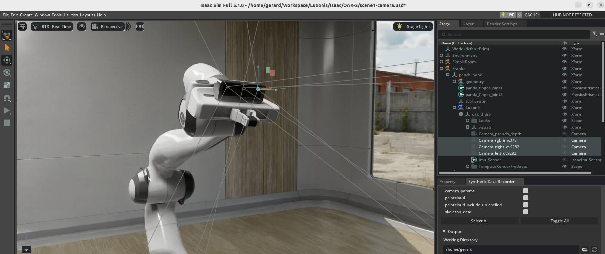

### 2.1 Sony IMX378 (RGB Camera)

| Property | Value |
|----------|-------|
| Sensor Type | CMOS, Rolling Shutter |
| Native Resolution | 4056 x 3040 (12.3 MP) |
| Used Resolution | 3840 x 2160 (4K) |
| Pixel Size | 1.55 µm |
| Optical Format | 1/2.3" |

### 2.2 OmniVision OV9282 (Stereo Cameras)

*Used in both OAK-D Pro (RVC2) and OAK4-D (RVC4) generations.*

| Property | Value |
|----------|-------|
| Sensor Type | CMOS, Global Shutter |
| Resolution | 1280 x 800 |
| Pixel Size | 3.0 µm |
| Optical Format | 1/4" |
| Stereo Baseline | 75 mm |

### 2.3 Sony IMX586 (RGB Camera - OAK4-D)

| Property | Value |
|----------|-------|
| Sensor Type | CMOS, Rolling Shutter (Quad-Bayer) |
| Native Resolution | 8000 x 6000 (48 MP) |
| Used Resolution | 4000 x 3000 (12 MP, Quad-Bayer binned) |
| Native Pixel Size | 0.8 µm |
| Effective Pixel Size (12MP) | 1.6 µm |
| Optical Format | 1/2" |

**Effective pixel size at 12MP:** The IMX586 has 0.8 µm native pixels at 8000x6000. At 4000x3000 output (2x2 Quad-Bayer binned), four sub-pixels are merged into one, giving an effective pixel size of 1.6 µm (= 6.4 mm sensor width / 4000 pixels). This is the calibrated output resolution used by the OAK4-D.

**Quad-Bayer technology:** The IMX586 uses a Quad-Bayer color filter array where four sub-pixels share the same color filter. This enables 48 MP capture in good light and 12 MP (4000x3000) binned mode as the standard output resolution.

### 2.4 OmniVision OV9782 (Stereo Cameras - OAK-D ToF)

*Color variant of OV9282 — same resolution and pixel size, adds Bayer color filter array.*

| Property | Value |
|----------|-------|
| Sensor Type | CMOS, Global Shutter |
| Resolution | 1280 x 800 |
| Pixel Size | 3.0 µm |
| Optical Format | 1/4" |
| Notes | Color variant of OV9282 (same pixel size/resolution, adds Bayer CFA) |

### 2.5 33D ToF Sensor (OAK-D ToF)

| Property | Value |
|----------|-------|
| Sensor Type | ToF (Time-of-Flight), Global Shutter |
| Resolution | 640 x 480 |
| Pixel Size | 7 µm |
| Optical Format | 1/3.2" |
| VCSEL Wavelength | 940 nm |
| Depth Range | 20 cm - 5 m |
| Depth Accuracy | < 1% indoors, < 2% outdoors |

---

## 3. OpenCV to USD Parameter Conversion

Following the [Isaac Sim Camera Documentation](https://docs.isaacsim.omniverse.nvidia.com/5.1.0/sensors/isaacsim_sensors_camera.html), camera parameters are converted from pixel-based coordinates to USD physical units (millimeters).

### 3.1 Conversion Formulas

**Theoretical intrinsics from spec-sheet HFOV:**
```
fx = width / (2 × tan(HFOV / 2))
fy = fx                              (square pixels assumed)
cx = width / 2                       (centered principal point)
cy = height / 2                      (centered principal point)
```

**Pixel-to-USD conversion:**
```
focal_length (mm) = pixel_size (µm) × fx (pixels) × 1e-3
horizontal_aperture (mm) = pixel_size (µm) × width (pixels) × 1e-3
vertical_aperture (mm) = pixel_size (µm) × height (pixels) × 1e-3
horizontal_aperture_offset (mm) = pixel_size (µm) × (cx - width/2) × 1e-3
vertical_aperture_offset (mm) = pixel_size (µm) × (cy - height/2) × 1e-3
```

Where:
- `fx`, `fy` = Focal length (pixels) — from HFOV spec or OpenCV calibration
- `cx`, `cy` = Principal point (pixels) — centered by default, or from calibration
- `width`, `height` = Image resolution (pixels)
- `pixel_size` = Physical pixel size from sensor datasheet (µm)

> **Note:** The USD assets ship with theoretical defaults (centered principal points, symmetric left/right stereo, zero aperture offsets). These nominal values are representative of the product line. For device-specific accuracy, override with real calibration data — see [Section 3.3](#33-device-specific-calibration-with-oak-viewer).

### 3.2 Sensor Pixel Sizes

| Sensor | Pixel Size | Used In |
|--------|------------|---------|
| Sony IMX378 | 1.55 µm | RGB Camera (OAK-D Pro) |
| Sony IMX586 | 0.8 µm (native) / 1.6 µm (12MP binned effective) | RGB Camera (OAK4-D) |
| OmniVision OV9282 | 3.0 µm | Stereo Cameras (all models) |
| OmniVision OV9782 | 3.0 µm | Stereo Cameras (OAK-D ToF) |
| 33D ToF Sensor | 7 µm | ToF Depth (OAK-D ToF) |

### 3.3 Device-Specific Calibration with OAK Viewer

The USD assets ship with nominal theoretical parameters suitable for general use. To customize the camera parameters for a specific OAK device:

1. **Export calibration data:** Open [OAK Viewer](https://docs.luxonis.com/software/tools/oak-viewer/) and connect your OAK device. Export the calibration JSON file, which contains the OpenCV intrinsic matrices (fx, fy, cx, cy) and distortion coefficients for each camera on the device.

2. **Extract intrinsics:** From the exported JSON, locate the `intrinsicMatrix` for each camera. The matrix format is `[[fx, 0, cx], [0, fy, cy], [0, 0, 1]]`.

3. **Apply conversion formulas:** Use the formulas from Section 3.1 to convert the device-specific OpenCV intrinsics to USD parameters:
   ```
   focal_length (mm) = pixel_size (µm) × ((fx + fy) / 2) × 1e-3
   horizontal_aperture_offset (mm) = pixel_size (µm) × (cx - width/2) × 1e-3
   vertical_aperture_offset (mm) = pixel_size (µm) × (cy - height/2) × 1e-3
   ```

4. **Update USD parameters:** Override the focalLength, horizontalApertureOffset, and verticalApertureOffset on each Camera prim. The horizontalAperture and verticalAperture values do not change (they depend on sensor pixel size and resolution, which are constant across units).

5. **Update depth simulation:** Set `focalLengthPixel` on the depth sensor RenderProduct to the device-specific `fx` value (rounded).

> **Note:** Real device calibration will introduce non-zero aperture offsets (principal point not exactly centered), slight differences between left and right stereo intrinsics, and per-device focal length variation. The depth sensor simulation parameters (baseline, noise, disparity limits) are model-level characteristics and should not be changed per-device.

---

## 4. Generating Depth Annotations

### 4.1 Ground Truth Depth (No Noise)

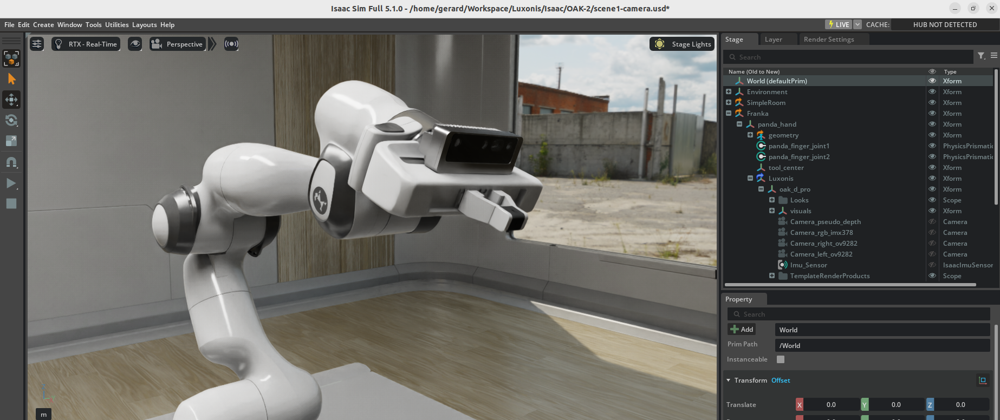

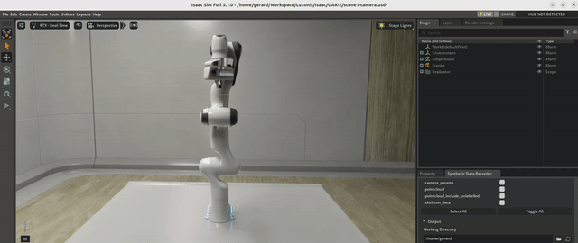


To generate perfect ground truth depth without noise, use the standard replicator annotators like distance_to_camera and distance_to_image_plane.

**Available Ground Truth Annotators:**
| Annotator | Description |
|-----------|-------------|
| `distance_to_image_plane` | Perpendicular Z-depth from camera plane |
| `distance_to_camera` | Euclidean distance from camera optical center |

### 4.2 Simulated Depth with Noise

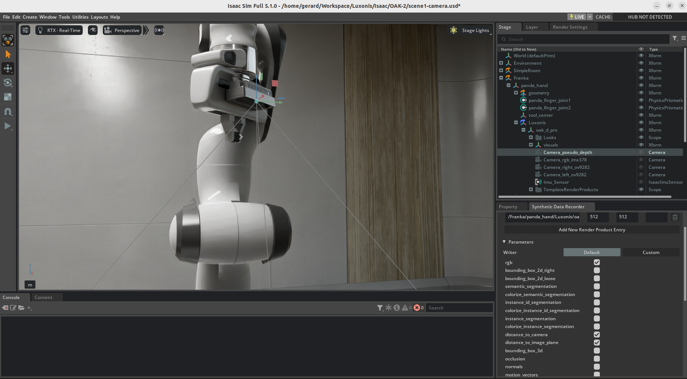

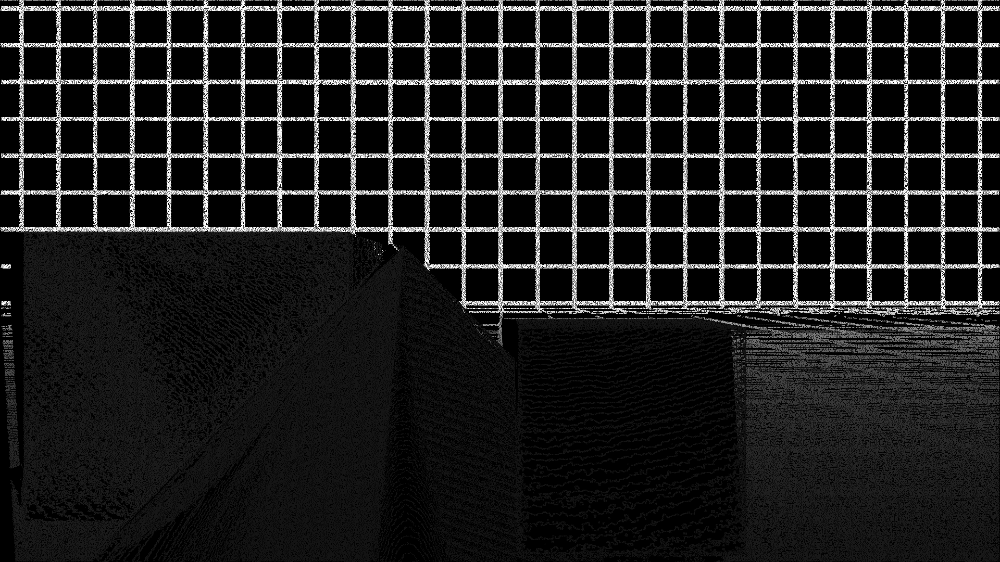
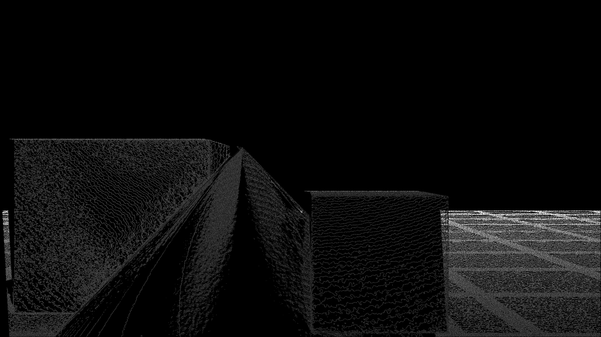
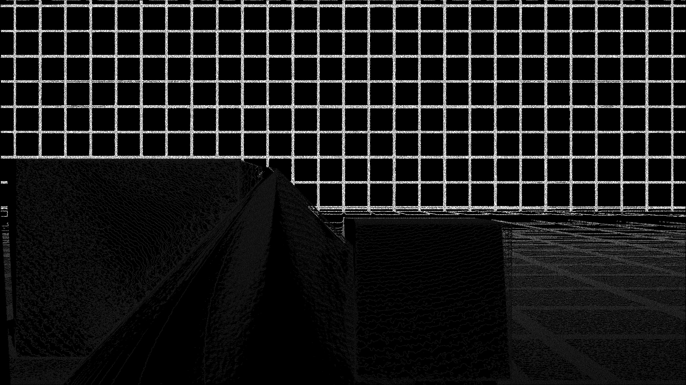

Different results changing Max Distance and Confidence level.

To generate realistic noisy depth matching OAK stereo sensor characteristics, use the `DepthSensorDistance` annotator with the `OmniSensorDepthSensorSingleViewAPI`.

Follow instructions [here](https://docs.isaacsim.omniverse.nvidia.com/5.1.0/sensors/isaacsim_sensors_camera_depth.html)

### 4.3 USD Asset Structure

Each OAK USD asset includes a pre-configured `TemplateRenderProducts` scope with the depth sensor RenderProduct:

**OAK-D Pro / OAK4-D (single depth sensor):**
```
Root (Xform)
└── oak_d_pro (Xform)
    ├── Camera_pseudo_depth (Camera)
    ├── Camera_rgb_imx378 (Camera)
    ├── Camera_left_ov9282 (Camera)
    ├── Camera_right_ov9282 (Camera)
    └── TemplateRenderProducts (Scope)
        └── Camera_pseudo_depth_render_product (RenderProduct)
            └── apiSchemas = ["OmniSensorDepthSensorSingleViewAPI"]
```

**OAK-D ToF (dual depth sensors — stereo + ToF):**
```
Root (Xform)
└── oak_d_tof (Xform)
    ├── Camera_pseudo_depth_stereo (Camera)
    ├── Camera_pseudo_depth_tof (Camera)
    ├── Camera_tof_33d (Camera)
    ├── Camera_left_ov9782 (Camera)
    ├── Camera_right_ov9782 (Camera)
    └── TemplateRenderProducts (Scope)
        ├── Camera_pseudo_depth_stereo_render_product (RenderProduct)
        │   └── apiSchemas = ["OmniSensorDepthSensorSingleViewAPI"]
        └── Camera_pseudo_depth_tof_render_product (RenderProduct)
            └── apiSchemas = ["OmniSensorDepthSensorSingleViewAPI"]
```

### 4.4 Comparison of Annotators

| Annotator | Output Type | Use Case |
|-----------|-------------|----------|
| `distance_to_image_plane` | Ground truth Z-depth | Training data, evaluation baseline |
| `distance_to_camera` | Ground truth radial distance | Point cloud generation |
| `DepthSensorDistance` | Simulated noisy depth | Realistic sensor simulation, domain randomization |

### 4.5 Camera_Pseudo_Depth

The `Camera_pseudo_depth` is a virtual camera used by Isaac Sim's depth sensor simulation pipeline. It uses the Left Stereo camera parameters for each device. The OAK-D ToF has two pseudo_depth cameras: `Camera_pseudo_depth_stereo` uses the left OV9782 intrinsics for stereo disparity-based depth, and `Camera_pseudo_depth_tof` uses the 33D ToF intrinsics for time-of-flight depth.

---

## 5. Camera Models

*Following the format from [Isaac Sim Camera and Depth Sensor Assets](https://docs.isaacsim.omniverse.nvidia.com/5.1.0/assets/usd_assets_camera_depth_sensors.html)*

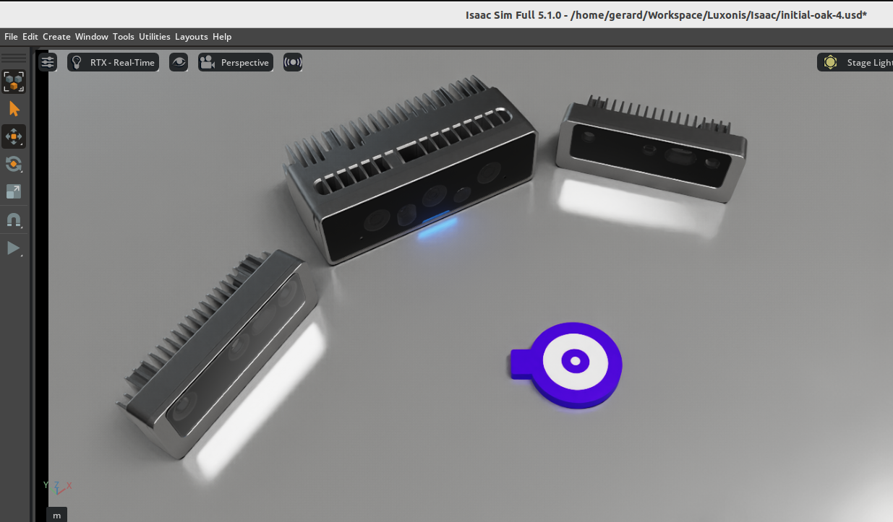

---

### 5.1 OAK-D Pro PoE

#### Quick Start

Drag and drop USD file into the Stage 

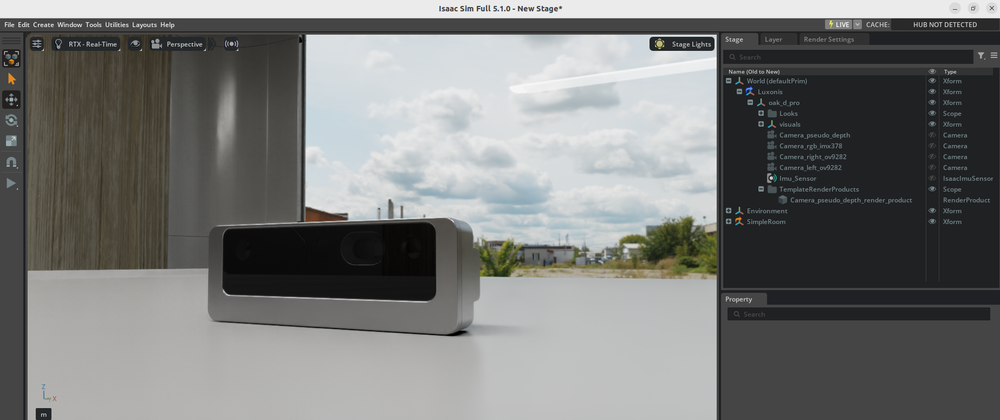

#### Device Information

| Property | Value |
|----------|-------|
| Manufacturer | Luxonis |
| Model | OAK-D Pro PoE (Fixed Focus) |
| RGB HFOV | ~64° |
| Stereo HFOV | ~77° |
| Dimensions | 111 x 40 x 31.3 mm |
| IMU | BNO086 9-axis |
| Ideal Range | 80cm - 12m |
| Depth Accuracy | under 2% at 4m |

#### Theoretical Intrinsics & USD Conversion

##### RGB Camera (Sony IMX378)

**Theoretical Intrinsics (from HFOV = 64°):**
```
fx = 3840 / (2 × tan(32°)) = 3072.64 pixels
fy = 3072.64 pixels (square pixels assumed)
cx = 1920.00 pixels (centered)
cy = 1080.00 pixels (centered)
width = 3840 pixels
height = 2160 pixels
pixel_size = 1.55 µm
```

**USD Parameter Calculation:**
```
focal_length = 1.55 × 3072.64 × 1e-3
             = 4.7626 mm

horizontal_aperture = 1.55 × 3840 × 1e-3
                    = 5.952 mm

vertical_aperture = 1.55 × 2160 × 1e-3
                  = 3.348 mm

horizontal_aperture_offset = 0.0 mm (centered)

vertical_aperture_offset = 0.0 mm (centered)
```

**HFOV Verification:**
```
HFOV = 2 × atan(h_aperture / (2 × focal_length))
     = 2 × atan(5.952 / (2 × 4.7626))
     = 2 × atan(0.6249)
     = 2 × 32.0°
     = 64.0° ✓
```

##### Stereo Cameras (OV9282) — Left & Right Identical

**Theoretical Intrinsics (from HFOV = 77°):**
```
fx = 1280 / (2 × tan(38.5°)) = 804.59 pixels
fy = 804.59 pixels (square pixels assumed)
cx = 640.00 pixels (centered)
cy = 400.00 pixels (centered)
width = 1280 pixels
height = 800 pixels
pixel_size = 3.0 µm
```

**USD Parameter Calculation:**
```
focal_length = 3.0 × 804.59 × 1e-3
             = 2.4138 mm

horizontal_aperture = 3.0 × 1280 × 1e-3
                    = 3.84 mm

vertical_aperture = 3.0 × 800 × 1e-3
                  = 2.40 mm

horizontal_aperture_offset = 0.0 mm (centered)

vertical_aperture_offset = 0.0 mm (centered)
```

**HFOV Verification:**
```
HFOV = 2 × atan(h_aperture / (2 × focal_length))
     = 2 × atan(3.84 / (2 × 2.4138))
     = 2 × atan(0.7954)
     = 2 × 38.5°
     = 77.0° ✓
```

#### Camera Features

| Parameter | Camera_rgb_imx378 | Camera_left_ov9282 | Camera_right_ov9282 |
|-----------|-------------------|--------------------|--------------------|
| **name** | Camera_rgb_imx378 | Camera_left_ov9282 | Camera_right_ov9282 |
| **focalLength** | 4.7626 | 2.4138 | 2.4138 |
| **focusDistance** | 500.0 | 196.0 | 196.0 |
| **fStop** | 0.0 | 0.0 | 0.0 |
| **projection** | perspective | perspective | perspective |
| **stereoRole** | mono | left | right |
| **horizontalAperture** | 5.952 | 3.84 | 3.84 |
| **verticalAperture** | 3.348 | 2.4 | 2.4 |
| **horizontalApertureOffset** | 0.0 | 0.0 | 0.0 |
| **verticalApertureOffset** | 0.0 | 0.0 | 0.0 |
| **clippingRange** | (0.01, 100.0) | (0.01, 100.0) | (0.01, 100.0) |
| **cameraProjectionType** | pinhole | pinhole | pinhole |
| **nominalWidth** | 3840 | 1280 | 1280 |
| **nominalHeight** | 2160 | 800 | 800 |
| **opticalCenterX** | 1920.00 | 640.00 | 640.00 |
| **opticalCenterY** | 1080.00 | 400.00 | 400.00 |
| **maxFOV** | 82.0 | 89.5 | 89.5 |
| **polyK0** | 0.0 | 0.0 | 0.0 |
| **polyK1** | 0.00245 | 0.00245 | 0.00245 |
| **polyK2** | 0.0 | 0.0 | 0.0 |
| **polyK3** | 0.0 | 0.0 | 0.0 |
| **polyK4** | 0.0 | 0.0 | 0.0 |
| **polyK5** | 0.0 | 0.0 | 0.0 |
| **p0** | -0.00037 | -0.00037 | -0.00037 |
| **p1** | -0.00074 | -0.00074 | -0.00074 |
| **s0** | -0.00058 | -0.00058 | -0.00058 |
| **s1** | -0.00022 | -0.00022 | -0.00022 |
| **s2** | 0.00019 | 0.00019 | 0.00019 |
| **s3** | -0.0002 | -0.0002 | -0.0002 |
| **physicalDistortionCoefficients** | Not Applicable | Not Applicable | Not Applicable |
| **physicalDistortionModel** | Not Applicable | Not Applicable | Not Applicable |

#### Camera_Pseudo_Depth Configuration

| Parameter | Value | Source |
|-----------|-------|--------|
| focalLength | 2.4138 | Stereo (OV9282) |
| horizontalAperture | 3.84 | Stereo (OV9282) |
| verticalAperture | 2.4 | Stereo (OV9282) |
| horizontalApertureOffset | 0.0 | Centered (theoretical) |
| verticalApertureOffset | 0.0 | Centered (theoretical) |
| focusDistance | 196.0 | OV9282 fixed focus |
| clippingRange | (0.01, 100.0) | Standard range |

#### Depth Sensor Simulation Parameters

| Parameter | Value | Description |
|-----------|-------|-------------|
| baselineMM | 75.0 | Stereo baseline (mm) |
| focalLengthPixel | 805.0 | Stereo focal length (pixels) — from HFOV = 77° |
| sensorSizePixel | 1280.0 | Sensor width (pixels) |
| maxDisparityPixel | 95.0 | Standard mode (191.0 for extended) |
| minDistance | 0.6 | Minimum depth (m) |
| maxDistance | 12.0 | Maximum depth (m) |
| noiseMean | 0.25 | Disparity bias (pixels) |
| noiseSigma | 0.2 | Disparity noise std dev (pixels) |
| noiseDownscaleFactorPixel | 2.0 | Spatial smoothing factor |
| confidenceThreshold | 0.8 | Match quality filter (0.0-1.0) |
| outlierRemovalRange | 3 | Outlier filter window size |

#### Note on Distortion Coefficients

The distortion parameters (polyK0-polyK5, p0, p1, s0-s3) are set to default and physicalDistortionModel is marked as **"Not Applicable"** following configuration of current supported devices.

---

### 5.2 OAK-D Pro W PoE (Wide FOV)

#### Quick Start

Drag and drop USD file into the Stage 

#### Device Information

| Property | Value |
|----------|-------|
| Manufacturer | Luxonis |
| Model | OAK-D Pro W PoE (Fixed Focus, Wide FOV) |
| RGB HFOV | ~80° |
| Stereo HFOV | ~97° |
| Dimensions | 111 x 40 x 31.3 mm |
| IMU | BNO086 9-axis |
| Ideal Range | 20cm - 8m |
| Depth Accuracy | under 2% at 4m |

#### Theoretical Intrinsics & USD Conversion

##### RGB Camera (Sony IMX378)

**Theoretical Intrinsics (from HFOV = 80°):**
```
fx = 3840 / (2 × tan(40°)) = 2288.17 pixels
fy = 2288.17 pixels (square pixels assumed)
cx = 1920.00 pixels (centered)
cy = 1080.00 pixels (centered)
width = 3840 pixels
height = 2160 pixels
pixel_size = 1.55 µm
```

**USD Parameter Calculation:**
```
focal_length = 1.55 × 2288.17 × 1e-3
             = 3.5467 mm

horizontal_aperture = 1.55 × 3840 × 1e-3
                    = 5.952 mm

vertical_aperture = 1.55 × 2160 × 1e-3
                  = 3.348 mm

horizontal_aperture_offset = 0.0 mm (centered)

vertical_aperture_offset = 0.0 mm (centered)
```

**HFOV Verification:**
```
HFOV = 2 × atan(h_aperture / (2 × focal_length))
     = 2 × atan(5.952 / (2 × 3.5467))
     = 2 × atan(0.8391)
     = 2 × 40.0°
     = 80.0° ✓
```

##### Stereo Cameras (OV9282) — Left & Right Identical

**Theoretical Intrinsics (from HFOV = 97°):**
```
fx = 1280 / (2 × tan(48.5°)) = 566.22 pixels
fy = 566.22 pixels (square pixels assumed)
cx = 640.00 pixels (centered)
cy = 400.00 pixels (centered)
width = 1280 pixels
height = 800 pixels
pixel_size = 3.0 µm
```

**USD Parameter Calculation:**
```
focal_length = 3.0 × 566.22 × 1e-3
             = 1.6987 mm

horizontal_aperture = 3.0 × 1280 × 1e-3
                    = 3.84 mm

vertical_aperture = 3.0 × 800 × 1e-3
                  = 2.40 mm

horizontal_aperture_offset = 0.0 mm (centered)

vertical_aperture_offset = 0.0 mm (centered)
```

**HFOV Verification:**
```
HFOV = 2 × atan(h_aperture / (2 × focal_length))
     = 2 × atan(3.84 / (2 × 1.6987))
     = 2 × atan(1.1302)
     = 2 × 48.5°
     = 97.0° ✓
```

#### Camera Features

| Parameter | Camera_rgb_imx378 | Camera_left_ov9282 | Camera_right_ov9282 |
|-----------|-------------------|--------------------|--------------------|
| **name** | Camera_rgb_imx378 | Camera_left_ov9282 | Camera_right_ov9282 |
| **focalLength** | 3.5467 | 1.6987 | 1.6987 |
| **focusDistance** | 500.0 | 196.0 | 196.0 |
| **fStop** | 0.0 | 0.0 | 0.0 |
| **projection** | perspective | perspective | perspective |
| **stereoRole** | mono | left | right |
| **horizontalAperture** | 5.952 | 3.84 | 3.84 |
| **verticalAperture** | 3.348 | 2.4 | 2.4 |
| **horizontalApertureOffset** | 0.0 | 0.0 | 0.0 |
| **verticalApertureOffset** | 0.0 | 0.0 | 0.0 |
| **clippingRange** | (0.01, 100.0) | (0.01, 100.0) | (0.01, 100.0) |
| **cameraProjectionType** | pinhole | pinhole | pinhole |
| **nominalWidth** | 3840 | 1280 | 1280 |
| **nominalHeight** | 2160 | 800 | 800 |
| **opticalCenterX** | 1920.00 | 640.00 | 640.00 |
| **opticalCenterY** | 1080.00 | 400.00 | 400.00 |
| **maxFOV** | 108.0 | 127.0 | 127.0 |
| **polyK0** | 0.0 | 0.0 | 0.0 |
| **polyK1** | 0.00245 | 0.00245 | 0.00245 |
| **polyK2** | 0.0 | 0.0 | 0.0 |
| **polyK3** | 0.0 | 0.0 | 0.0 |
| **polyK4** | 0.0 | 0.0 | 0.0 |
| **polyK5** | 0.0 | 0.0 | 0.0 |
| **p0** | -0.00037 | -0.00037 | -0.00037 |
| **p1** | -0.00074 | -0.00074 | -0.00074 |
| **s0** | -0.00058 | -0.00058 | -0.00058 |
| **s1** | -0.00022 | -0.00022 | -0.00022 |
| **s2** | 0.00019 | 0.00019 | 0.00019 |
| **s3** | -0.0002 | -0.0002 | -0.0002 |
| **physicalDistortionCoefficients** | Not Applicable | Not Applicable | Not Applicable |
| **physicalDistortionModel** | Not Applicable | Not Applicable | Not Applicable |

#### Camera_Pseudo_Depth Configuration

| Parameter | Value | Source |
|-----------|-------|--------|
| focalLength | 1.6987 | Stereo (OV9282) |
| horizontalAperture | 3.84 | Stereo (OV9282) |
| verticalAperture | 2.4 | Stereo (OV9282) |
| horizontalApertureOffset | 0.0 | Centered (theoretical) |
| verticalApertureOffset | 0.0 | Centered (theoretical) |
| focusDistance | 196.0 | OV9282 fixed focus |
| clippingRange | (0.01, 100.0) | Standard range |

#### Depth Sensor Simulation Parameters

| Parameter | Value | Description |
|-----------|-------|-------------|
| baselineMM | 75.0 | Stereo baseline (mm) |
| focalLengthPixel | 566.0 | Stereo focal length (pixels) — from HFOV = 97° |
| sensorSizePixel | 1280.0 | Sensor width (pixels) |
| maxDisparityPixel | 95.0 | Standard mode (191.0 for extended) |
| minDistance | 0.2 | Minimum depth (m) - closer min due to wider FOV |
| maxDistance | 8.0 | Maximum depth (m) - shorter max range |
| noiseMean | 0.25 | Disparity bias (pixels) |
| noiseSigma | 0.2 | Disparity noise std dev (pixels) |
| noiseDownscaleFactorPixel | 2.0 | Spatial smoothing factor |
| confidenceThreshold | 0.8 | Match quality filter (0.0-1.0) |
| outlierRemovalRange | 3 | Outlier filter window size |

**Note:** Min/max distance estimates based on disparity formula:
- minDistance = baseline × focalLength / maxDisparity = 75 × 566 / 95 / 1000 ≈ 0.45m
- Wider FOV allows closer operation in practice (~0.2m)

#### Note on Distortion Coefficients

The distortion parameters (polyK0-polyK5, p0, p1, s0-s3) are set to default and physicalDistortionModel is marked as **"Not Applicable"** following configuration of current supported devices.

---

### 5.3 OAK4-D (RVC4)

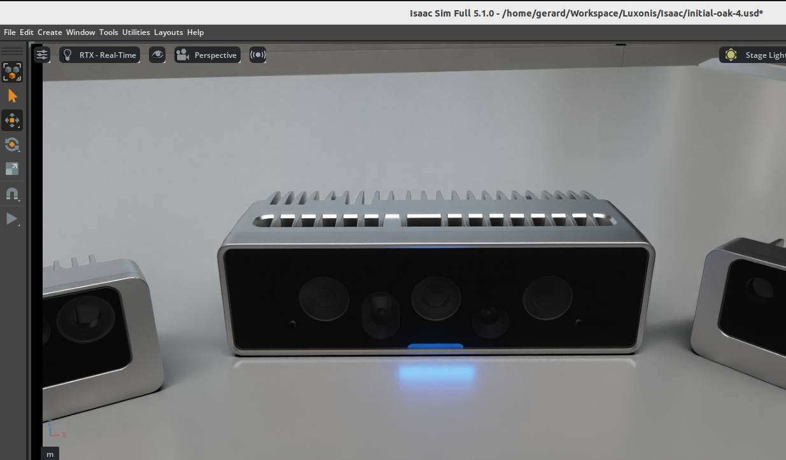

#### Quick Start

Drag and drop USD file into the Stage 

#### Device Information

| Property | Value |
|----------|-------|
| Manufacturer | Luxonis |
| Model | OAK4-D |
| Platform | RVC4 (Qualcomm QCS8550) |
| RGB Sensor | Sony IMX586 (48 MP, Quad-Bayer) |
| Stereo Sensor | OmniVision OV9282 |
| RGB HFOV | ~68° |
| Stereo HFOV | ~77° |
| IMU | ICM-42688-P (6-axis) + AK09919C (magnetometer) |
| Stereo Baseline | 75 mm |
| Ideal Range | 60cm - 12m |
| Depth Accuracy | under 1.5% at 4m |

#### Theoretical Intrinsics & USD Conversion

##### RGB Camera (Sony IMX586)

**Theoretical Intrinsics (from HFOV = 68°):**
```
fx = 4000 / (2 × tan(34°)) = 2965.12 pixels
fy = 2965.12 pixels (square pixels assumed)
cx = 2000.00 pixels (centered)
cy = 1500.00 pixels (centered)
width = 4000 pixels
height = 3000 pixels
pixel_size = 1.6 µm (effective, Quad-Bayer 2x2 binned)
```

**USD Parameter Calculation:**
```
focal_length = 1.6 × 2965.12 × 1e-3
             = 4.7442 mm

horizontal_aperture = 1.6 × 4000 × 1e-3
                    = 6.400 mm

vertical_aperture = 1.6 × 3000 × 1e-3
                  = 4.800 mm

horizontal_aperture_offset = 0.0 mm (centered)

vertical_aperture_offset = 0.0 mm (centered)
```

**HFOV Verification:**
```
HFOV = 2 × atan(h_aperture / (2 × focal_length))
     = 2 × atan(6.400 / (2 × 4.7442))
     = 2 × atan(0.6745)
     = 2 × 34.0°
     = 68.0° ✓
```

##### Stereo Cameras (OV9282) — Left & Right Identical

**Theoretical Intrinsics (from HFOV = 77°):**
```
fx = 1280 / (2 × tan(38.5°)) = 804.59 pixels
fy = 804.59 pixels (square pixels assumed)
cx = 640.00 pixels (centered)
cy = 400.00 pixels (centered)
width = 1280 pixels
height = 800 pixels
pixel_size = 3.0 µm
```

**USD Parameter Calculation:**
```
focal_length = 3.0 × 804.59 × 1e-3
             = 2.4138 mm

horizontal_aperture = 3.0 × 1280 × 1e-3
                    = 3.84 mm

vertical_aperture = 3.0 × 800 × 1e-3
                  = 2.40 mm

horizontal_aperture_offset = 0.0 mm (centered)

vertical_aperture_offset = 0.0 mm (centered)
```

**HFOV Verification:**
```
HFOV = 2 × atan(h_aperture / (2 × focal_length))
     = 2 × atan(3.84 / (2 × 2.4138))
     = 2 × atan(0.7954)
     = 2 × 38.5°
     = 77.0° ✓
```

#### Camera Features

| Parameter | Camera_rgb_imx586 | Camera_left_ov9282 | Camera_right_ov9282 |
|-----------|-------------------|--------------------|--------------------|
| **name** | Camera_rgb_imx586 | Camera_left_ov9282 | Camera_right_ov9282 |
| **focalLength** | 4.7442 | 2.4138 | 2.4138 |
| **focusDistance** | 500.0 | 196.0 | 196.0 |
| **fStop** | 0.0 | 0.0 | 0.0 |
| **projection** | perspective | perspective | perspective |
| **stereoRole** | mono | left | right |
| **horizontalAperture** | 6.400 | 3.84 | 3.84 |
| **verticalAperture** | 4.800 | 2.4 | 2.4 |
| **horizontalApertureOffset** | 0.0 | 0.0 | 0.0 |
| **verticalApertureOffset** | 0.0 | 0.0 | 0.0 |
| **clippingRange** | (0.01, 100.0) | (0.01, 100.0) | (0.01, 100.0) |
| **cameraProjectionType** | pinhole | pinhole | pinhole |
| **nominalWidth** | 4000 | 1280 | 1280 |
| **nominalHeight** | 3000 | 800 | 800 |
| **opticalCenterX** | 2000.00 | 640.00 | 640.00 |
| **opticalCenterY** | 1500.00 | 400.00 | 400.00 |
| **maxFOV** | 80.3 | 86.3 | 86.3 |
| **polyK0** | 0.0 | 0.0 | 0.0 |
| **polyK1** | 0.00245 | 0.00245 | 0.00245 |
| **polyK2** | 0.0 | 0.0 | 0.0 |
| **polyK3** | 0.0 | 0.0 | 0.0 |
| **polyK4** | 0.0 | 0.0 | 0.0 |
| **polyK5** | 0.0 | 0.0 | 0.0 |
| **p0** | -0.00037 | -0.00037 | -0.00037 |
| **p1** | -0.00074 | -0.00074 | -0.00074 |
| **s0** | -0.00058 | -0.00058 | -0.00058 |
| **s1** | -0.00022 | -0.00022 | -0.00022 |
| **s2** | 0.00019 | 0.00019 | 0.00019 |
| **s3** | -0.0002 | -0.0002 | -0.0002 |
| **physicalDistortionCoefficients** | Not Applicable | Not Applicable | Not Applicable |
| **physicalDistortionModel** | Not Applicable | Not Applicable | Not Applicable |

#### Camera_Pseudo_Depth Configuration

| Parameter | Value | Source |
|-----------|-------|--------|
| focalLength | 2.4138 | Stereo (OV9282) |
| horizontalAperture | 3.84 | Stereo (OV9282) |
| verticalAperture | 2.4 | Stereo (OV9282) |
| horizontalApertureOffset | 0.0 | Centered (theoretical) |
| verticalApertureOffset | 0.0 | Centered (theoretical) |
| focusDistance | 196.0 | OV9282 fixed focus |
| clippingRange | (0.01, 100.0) | Standard range |

#### Depth Sensor Simulation Parameters

| Parameter | Value | Description |
|-----------|-------|-------------|
| baselineMM | 75.0 | Stereo baseline (mm) |
| focalLengthPixel | 805.0 | Stereo focal length (pixels) — from HFOV = 77° |
| sensorSizePixel | 1280.0 | Sensor width (pixels) |
| maxDisparityPixel | 95.0 | Standard mode (191.0 for extended) |
| minDistance | 0.6 | Minimum depth (m) — standard mode |
| maxDistance | 12.0 | Maximum depth (m) |
| noiseMean | 0.25 | Disparity bias (pixels) |
| noiseSigma | 0.2 | Disparity noise std dev (pixels) |
| noiseDownscaleFactorPixel | 2.0 | Spatial smoothing factor |
| confidenceThreshold | 0.8 | Match quality filter (0.0-1.0) |
| outlierRemovalRange | 3 | Outlier filter window size |

**Note:** Min distance estimates based on disparity formula:
- Standard mode: minDistance = baseline × focalLength / maxDisparity = 75 × 805 / 95 / 1000 ≈ 0.64m (rounded to 0.6m)
- Extended mode: minDistance = 75 × 805 / 191 / 1000 ≈ 0.32m (~0.3m)

#### Note on Distortion Coefficients

The distortion parameters (polyK0-polyK5, p0, p1, s0-s3) are set to default and physicalDistortionModel is marked as **"Not Applicable"** following configuration of current supported devices.

---

### 5.4 OAK4-D Wide (RVC4)

#### Device Information

| Property | Value |
|----------|-------|
| Manufacturer | Luxonis |
| Model | OAK4-D Wide FOV |
| Platform | RVC4 (Qualcomm QCS8550) |
| RGB Sensor | Sony IMX586 (48 MP, Quad-Bayer) |
| Stereo Sensor | OmniVision OV9282 |
| RGB HFOV | ~88° (pinhole equivalent) |
| Stereo HFOV | ~97° (pinhole equivalent) |
| IMU | ICM-42688-P (6-axis) + AK09919C (magnetometer) |
| Stereo Baseline | 75 mm |
| Ideal Range | 20cm - 8m |
| Depth Accuracy | < 2% at 3.5m (estimated from Wide FOV OAK data) |

> **Note on spec-sheet FOV vs pinhole FOV:** The Luxonis spec sheet lists HFOV = 127° (stereo) and HFOV = 95° (RGB). These values include barrel distortion from the wide-angle optics. Isaac Sim uses a pinhole camera model where distortion is not applied (physicalDistortionModel = "Not Applicable"), so the **pinhole-equivalent HFOV** is narrower. The values below are derived from the OAK-D Pro W PoE real calibration (same wide OV9282 stereo optics, HFOV ≈ 97°) and from the VFOV spec (RGB VFOV = 72° → pinhole HFOV ≈ 88°). To obtain exact values for your device, export calibration data using [OAK Viewer](#33-device-specific-calibration-with-oak-viewer).

#### Quick Start

Drag and drop USD file into the Stage 

#### Theoretical Intrinsics & USD Conversion

##### RGB Camera (Sony IMX586)

**Theoretical Intrinsics (from HFOV = 88°):**
```
fx = 4000 / (2 × tan(44°)) = 2071.06 pixels
fy = 2071.06 pixels (square pixels assumed)
cx = 2000.00 pixels (centered)
cy = 1500.00 pixels (centered)
width = 4000 pixels
height = 3000 pixels
pixel_size = 1.6 µm (effective, Quad-Bayer 2x2 binned)
```

**USD Parameter Calculation:**
```
focal_length = 1.6 × 2071.06 × 1e-3
             = 3.3137 mm

horizontal_aperture = 1.6 × 4000 × 1e-3
                    = 6.400 mm

vertical_aperture = 1.6 × 3000 × 1e-3
                  = 4.800 mm

horizontal_aperture_offset = 0.0 mm (centered)

vertical_aperture_offset = 0.0 mm (centered)
```

**HFOV Verification:**
```
HFOV = 2 × atan(h_aperture / (2 × focal_length))
     = 2 × atan(6.400 / (2 × 3.3137))
     = 2 × atan(0.9655)
     = 2 × 44.0°
     = 88.0° ✓
```

##### Stereo Cameras (OV9282) — Left & Right Identical

**Theoretical Intrinsics (from HFOV = 97°):**
```
fx = 1280 / (2 × tan(48.5°)) = 566.22 pixels
fy = 566.22 pixels (square pixels assumed)
cx = 640.00 pixels (centered)
cy = 400.00 pixels (centered)
width = 1280 pixels
height = 800 pixels
pixel_size = 3.0 µm
```

**USD Parameter Calculation:**
```
focal_length = 3.0 × 566.22 × 1e-3
             = 1.6987 mm

horizontal_aperture = 3.0 × 1280 × 1e-3
                    = 3.84 mm

vertical_aperture = 3.0 × 800 × 1e-3
                  = 2.40 mm

horizontal_aperture_offset = 0.0 mm (centered)

vertical_aperture_offset = 0.0 mm (centered)
```

**HFOV Verification:**
```
HFOV = 2 × atan(h_aperture / (2 × focal_length))
     = 2 × atan(3.84 / (2 × 1.6987))
     = 2 × atan(1.1302)
     = 2 × 48.5°
     = 97.0° ✓
```

#### Camera Features

| Parameter | Camera_rgb_imx586 | Camera_left_ov9282 | Camera_right_ov9282 |
|-----------|-------------------|--------------------|--------------------|
| **name** | Camera_rgb_imx586 | Camera_left_ov9282 | Camera_right_ov9282 |
| **focalLength** | 3.3137 | 1.6987 | 1.6987 |
| **focusDistance** | 500.0 | 196.0 | 196.0 |
| **fStop** | 0.0 | 0.0 | 0.0 |
| **projection** | perspective | perspective | perspective |
| **stereoRole** | mono | left | right |
| **horizontalAperture** | 6.400 | 3.84 | 3.84 |
| **verticalAperture** | 4.800 | 2.4 | 2.4 |
| **horizontalApertureOffset** | 0.0 | 0.0 | 0.0 |
| **verticalApertureOffset** | 0.0 | 0.0 | 0.0 |
| **clippingRange** | (0.01, 100.0) | (0.01, 100.0) | (0.01, 100.0) |
| **cameraProjectionType** | pinhole | pinhole | pinhole |
| **nominalWidth** | 4000 | 1280 | 1280 |
| **nominalHeight** | 3000 | 800 | 800 |
| **opticalCenterX** | 2000.00 | 640.00 | 640.00 |
| **opticalCenterY** | 1500.00 | 400.00 | 400.00 |
| **maxFOV** | 100.7 | 106.2 | 106.2 |
| **polyK0** | 0.0 | 0.0 | 0.0 |
| **polyK1** | 0.00245 | 0.00245 | 0.00245 |
| **polyK2** | 0.0 | 0.0 | 0.0 |
| **polyK3** | 0.0 | 0.0 | 0.0 |
| **polyK4** | 0.0 | 0.0 | 0.0 |
| **polyK5** | 0.0 | 0.0 | 0.0 |
| **p0** | -0.00037 | -0.00037 | -0.00037 |
| **p1** | -0.00074 | -0.00074 | -0.00074 |
| **s0** | -0.00058 | -0.00058 | -0.00058 |
| **s1** | -0.00022 | -0.00022 | -0.00022 |
| **s2** | 0.00019 | 0.00019 | 0.00019 |
| **s3** | -0.0002 | -0.0002 | -0.0002 |
| **physicalDistortionCoefficients** | Not Applicable | Not Applicable | Not Applicable |
| **physicalDistortionModel** | Not Applicable | Not Applicable | Not Applicable |

#### Camera_Pseudo_Depth Configuration

| Parameter | Value | Source |
|-----------|-------|--------|
| focalLength | 1.6987 | Stereo (OV9282) |
| horizontalAperture | 3.84 | Stereo (OV9282) |
| verticalAperture | 2.4 | Stereo (OV9282) |
| horizontalApertureOffset | 0.0 | Centered (theoretical) |
| verticalApertureOffset | 0.0 | Centered (theoretical) |
| focusDistance | 196.0 | OV9282 fixed focus |
| clippingRange | (0.01, 100.0) | Standard range |

#### Depth Sensor Simulation Parameters

| Parameter | Value | Description |
|-----------|-------|-------------|
| baselineMM | 75.0 | Stereo baseline (mm) |
| focalLengthPixel | 566.0 | Stereo focal length (pixels) — from HFOV = 97° |
| sensorSizePixel | 1280.0 | Sensor width (pixels) |
| maxDisparityPixel | 95.0 | Standard mode (191.0 for extended) |
| minDistance | 0.2 | Minimum depth (m) — closer min due to wider FOV |
| maxDistance | 8.0 | Maximum depth (m) — shorter max range |
| noiseMean | 0.25 | Disparity bias (pixels) |
| noiseSigma | 0.2 | Disparity noise std dev (pixels) |
| noiseDownscaleFactorPixel | 2.0 | Spatial smoothing factor |
| confidenceThreshold | 0.8 | Match quality filter (0.0-1.0) |
| outlierRemovalRange | 3 | Outlier filter window size |

**Note:** Min/max distance estimates based on disparity formula:
- minDistance = baseline × focalLength / maxDisparity = 75 × 566 / 95 / 1000 ≈ 0.45m
- Wider FOV allows closer operation in practice (~0.2m)

#### Note on Distortion Coefficients

The distortion parameters (polyK0-polyK5, p0, p1, s0-s3) are set to default and physicalDistortionModel is marked as **"Not Applicable"** following configuration of current supported devices.

---

### 5.5 OAK-D ToF (RVC2)

#### Device Information

| Property | Value |
|----------|-------|
| Manufacturer | Luxonis |
| Model | OAK-D ToF |
| Platform | RVC2 (Intel Myriad X) |
| ToF Sensor | 33D (640x480, ToF) |
| Stereo Sensor | OmniVision OV9782 (color) |
| RGB Camera | None |
| ToF HFOV | ~70° |
| Stereo HFOV | ~80° |
| IMU | Yes |
| Stereo Baseline | 20 mm |
| ToF Baseline (sim) | 0.5 mm |
| Ideal Range (stereo) | 30cm - 1m |
| Ideal Range (ToF) | 20cm - 5m |
| Depth Accuracy (ToF) | < 1% indoors, < 2% outdoors |

#### OpenCV-Equivalent Theoretical Intrinsics & USD Conversion

##### ToF Camera (33D)

**Theoretical Intrinsics (from HFOV = 70°):**
```
fx = 640 / (2 × tan(35°)) = 457.01 pixels
fy = 457.01 pixels (square pixels assumed)
cx = 320.00 pixels (centered)
cy = 240.00 pixels (centered)
width = 640 pixels
height = 480 pixels
pixel_size = 7 µm
```

**USD Parameter Calculation:**
```
focal_length = 7 × ((457.01 + 457.01) / 2) × 1e-3
             = 7 × 457.01 × 0.001
             = 3.1991 mm

horizontal_aperture = 7 × 640 × 1e-3
                    = 4.480 mm

vertical_aperture = 7 × 480 × 1e-3
                  = 3.360 mm

horizontal_aperture_offset = 7 × (320.00 - 640/2) × 1e-3
                           = 7 × 0 × 0.001
                           = 0.0 mm

vertical_aperture_offset = 7 × (240.00 - 480/2) × 1e-3
                         = 7 × 0 × 0.001
                         = 0.0 mm
```

**HFOV Verification:**
```
HFOV = 2 × atan(h_aperture / (2 × focal_length))
     = 2 × atan(4.480 / (2 × 3.1991))
     = 2 × atan(0.7002)
     = 2 × 34.98°
     = 70.0° ✓
```

##### Left Stereo Camera (OV9782)

**Theoretical Intrinsics (from HFOV = 80°):**
```
fx = 1280 / (2 × tan(40°)) = 762.72 pixels
fy = 762.72 pixels (square pixels assumed)
cx = 640.00 pixels (centered)
cy = 400.00 pixels (centered)
width = 1280 pixels
height = 800 pixels
pixel_size = 3.0 µm
```

**USD Parameter Calculation:**
```
focal_length = 3.0 × ((762.72 + 762.72) / 2) × 1e-3
             = 3.0 × 762.72 × 0.001
             = 2.2882 mm

horizontal_aperture = 3.0 × 1280 × 1e-3
                    = 3.840 mm

vertical_aperture = 3.0 × 800 × 1e-3
                  = 2.400 mm

horizontal_aperture_offset = 3.0 × (640.00 - 1280/2) × 1e-3
                           = 3.0 × 0 × 0.001
                           = 0.0 mm

vertical_aperture_offset = 3.0 × (400.00 - 800/2) × 1e-3
                         = 3.0 × 0 × 0.001
                         = 0.0 mm
```

**HFOV Verification:**
```
HFOV = 2 × atan(h_aperture / (2 × focal_length))
     = 2 × atan(3.840 / (2 × 2.2882))
     = 2 × atan(0.8391)
     = 2 × 40.00°
     = 80.0° ✓
```

##### Right Stereo Camera (OV9782)

Identical to Left Stereo Camera — theoretical parameters assume centered optics with no per-device variance.

**Theoretical Intrinsics:**
```
fx = 762.72 pixels
fy = 762.72 pixels
cx = 640.00 pixels
cy = 400.00 pixels
width = 1280 pixels
height = 800 pixels
pixel_size = 3.0 µm
```

**USD Parameters:** Same as Left Stereo Camera (focal_length = 2.2882 mm, h_aperture = 3.840 mm, v_aperture = 2.400 mm, offsets = 0.0 mm).

#### Camera Features

| Parameter | Camera_tof_33d | Camera_left_ov9782 | Camera_right_ov9782 |
|-----------|---------------|--------------------|--------------------|
| **name** | Camera_tof_33d | Camera_left_ov9782 | Camera_right_ov9782 |
| **focalLength** | 3.1991 | 2.2882 | 2.2882 |
| **focusDistance** | 500.0 | 196.0 | 196.0 |
| **fStop** | 0.0 | 0.0 | 0.0 |
| **projection** | perspective | perspective | perspective |
| **stereoRole** | mono | left | right |
| **horizontalAperture** | 4.480 | 3.840 | 3.840 |
| **verticalAperture** | 3.360 | 2.400 | 2.400 |
| **horizontalApertureOffset** | 0.0 | 0.0 | 0.0 |
| **verticalApertureOffset** | 0.0 | 0.0 | 0.0 |
| **clippingRange** | (0.01, 100.0) | (0.01, 100.0) | (0.01, 100.0) |
| **cameraProjectionType** | pinhole | pinhole | pinhole |
| **nominalWidth** | 640 | 1280 | 1280 |
| **nominalHeight** | 480 | 800 | 800 |
| **opticalCenterX** | 320.00 | 640.00 | 640.00 |
| **opticalCenterY** | 240.00 | 400.00 | 400.00 |
| **maxFOV** | 70.0 | 80.0 | 80.0 |
| **polyK0** | 0.0 | 0.0 | 0.0 |
| **polyK1** | 0.00245 | 0.00245 | 0.00245 |
| **polyK2** | 0.0 | 0.0 | 0.0 |
| **polyK3** | 0.0 | 0.0 | 0.0 |
| **polyK4** | 0.0 | 0.0 | 0.0 |
| **polyK5** | 0.0 | 0.0 | 0.0 |
| **p0** | -0.00037 | -0.00037 | -0.00037 |
| **p1** | -0.00074 | -0.00074 | -0.00074 |
| **s0** | -0.00058 | -0.00058 | -0.00058 |
| **s1** | -0.00022 | -0.00022 | -0.00022 |
| **s2** | 0.00019 | 0.00019 | 0.00019 |
| **s3** | -0.0002 | -0.0002 | -0.0002 |
| **physicalDistortionCoefficients** | Not Applicable | Not Applicable | Not Applicable |
| **physicalDistortionModel** | Not Applicable | Not Applicable | Not Applicable |

#### Camera_Pseudo_Depth_Stereo Configuration

| Parameter | Value | Source |
|-----------|-------|--------|
| focalLength | 2.2882 | Stereo (OV9782) |
| horizontalAperture | 3.840 | Stereo (OV9782) |
| verticalAperture | 2.400 | Stereo (OV9782) |
| horizontalApertureOffset | 0.0 | Centered (theoretical) |
| verticalApertureOffset | 0.0 | Centered (theoretical) |
| focusDistance | 196.0 | OV9782 fixed focus |
| clippingRange | (0.01, 100.0) | Standard range |

#### Camera_Pseudo_Depth_ToF Configuration

| Parameter | Value | Source |
|-----------|-------|--------|
| focalLength | 3.1991 | ToF sensor (33D) |
| horizontalAperture | 4.480 | ToF sensor (33D) |
| verticalAperture | 3.360 | ToF sensor (33D) |
| horizontalApertureOffset | 0.0 | Centered (theoretical) |
| verticalApertureOffset | 0.0 | Centered (theoretical) |
| focusDistance | 500.0 | 33D ToF |
| clippingRange | (0.01, 100.0) | Standard range |

#### Stereo Depth Sensor Simulation Parameters

| Parameter | Value | Description |
|-----------|-------|-------------|
| baselineMM | 20.0 | Stereo baseline (mm) |
| focalLengthPixel | 763.0 | Stereo focal length (pixels) |
| sensorSizePixel | 1280.0 | Sensor width (pixels) |
| maxDisparityPixel | 95.0 | Standard mode |
| minDistance | 0.2 | Minimum depth (m) — spec: MinZ 20cm at 800P |
| maxDistance | 5.0 | Maximum depth (m) |
| noiseMean | 0.25 | Disparity bias (pixels) |
| noiseSigma | 0.2 | Disparity noise std dev (pixels) |
| noiseDownscaleFactorPixel | 2.0 | Spatial smoothing factor |
| confidenceThreshold | 0.8 | Match quality filter (0.0-1.0) |
| outlierRemovalRange | 3 | Outlier filter window size |

**Note:** Min distance from disparity formula:
- minDistance = baseline × focalLength / maxDisparity = 20 × 763 / 95 / 1000 ≈ 0.161m (rounded to 0.2m per spec)

#### ToF Depth Sensor Simulation Parameters

| Parameter | Value | Description |
|-----------|-------|-------------|
| baselineMM | 0.5 | Minimal baseline for single-sensor ToF (mm) |
| focalLengthPixel | 457.0 | ToF focal length (pixels) |
| sensorSizePixel | 640.0 | Sensor width (pixels) |
| maxDisparityPixel | 95.0 | Standard mode |
| minDistance | 0.2 | Minimum depth (m) — spec: 20cm |
| maxDistance | 5.0 | Maximum depth (m) — spec: 5m |
| noiseMean | 0.1 | Lower than stereo: ToF has <1% error indoors |
| noiseSigma | 0.1 | Lower than stereo: ToF has <1% error indoors |
| noiseDownscaleFactorPixel | 2.0 | Spatial smoothing factor |
| confidenceThreshold | 0.8 | Match quality filter (0.0-1.0) |
| outlierRemovalRange | 3 | Outlier filter window size |

#### Note on Theoretical Values

All camera parameters across all models are computed theoretically from spec sheet HFOV values with centered principal points and symmetric left/right stereo cameras. To customize for a specific device, export calibration data using OAK Viewer and apply the conversion formulas from [Section 3.3](#33-device-specific-calibration-with-oak-viewer).

---

## 6. Quick Reference

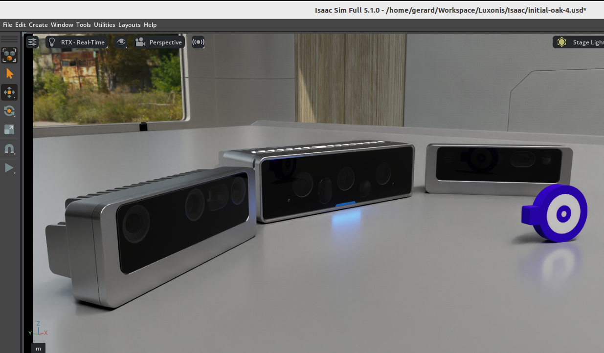

### Computed USD Parameters Summary

**OAK-D Pro PoE (Standard FOV)**
| Camera | focalLength | hAperture | vAperture | hOffset | vOffset |
|--------|-------------|-----------|-----------|---------|---------|
| RGB (IMX378) | 4.7626 | 5.952 | 3.348 | 0.0 | 0.0 |
| Stereo (OV9282) | 2.4138 | 3.84 | 2.4 | 0.0 | 0.0 |
| Pseudo Depth | 2.4138 | 3.84 | 2.4 | 0.0 | 0.0 |

**OAK-D Pro W PoE (Wide FOV)**
| Camera | focalLength | hAperture | vAperture | hOffset | vOffset |
|--------|-------------|-----------|-----------|---------|---------|
| RGB (IMX378) | 3.5467 | 5.952 | 3.348 | 0.0 | 0.0 |
| Stereo (OV9282) | 1.6987 | 3.84 | 2.4 | 0.0 | 0.0 |
| Pseudo Depth | 1.6987 | 3.84 | 2.4 | 0.0 | 0.0 |

**OAK4-D (RVC4)**
| Camera | focalLength | hAperture | vAperture | hOffset | vOffset |
|--------|-------------|-----------|-----------|---------|---------|
| RGB (IMX586) | 4.7442 | 6.400 | 4.800 | 0.0 | 0.0 |
| Stereo (OV9282) | 2.4138 | 3.84 | 2.4 | 0.0 | 0.0 |
| Pseudo Depth | 2.4138 | 3.84 | 2.4 | 0.0 | 0.0 |

**OAK4-D Wide (RVC4)**
| Camera | focalLength | hAperture | vAperture | hOffset | vOffset |
|--------|-------------|-----------|-----------|---------|---------|
| RGB (IMX586) | 3.3137 | 6.400 | 4.800 | 0.0 | 0.0 |
| Stereo (OV9282) | 1.6987 | 3.84 | 2.4 | 0.0 | 0.0 |
| Pseudo Depth | 1.6987 | 3.84 | 2.4 | 0.0 | 0.0 |

**OAK-D ToF (RVC2)**
| Camera | focalLength | hAperture | vAperture | hOffset | vOffset |
|--------|-------------|-----------|-----------|---------|---------|
| ToF (33D) | 3.1991 | 4.480 | 3.360 | 0.0 | 0.0 |
| Stereo (OV9782) | 2.2882 | 3.840 | 2.400 | 0.0 | 0.0 |
| Pseudo Depth (Stereo) | 2.2882 | 3.840 | 2.400 | 0.0 | 0.0 |
| Pseudo Depth (ToF) | 3.1991 | 4.480 | 3.360 | 0.0 | 0.0 |

### Depth Sensor Parameters Comparison

| Parameter | OAK-D Pro PoE | OAK-D Pro W PoE | OAK4-D | OAK4-D Wide | OAK-D ToF (Stereo) | OAK-D ToF (ToF) |
|-----------|---------------|-----------------|--------|-------------|---------------------|------------------|
| focalLengthPixel | 805.0 | 566.0 | 805.0 | 566.0 | 763.0 | 457.0 |
| minDistance (m) | 0.6 | 0.2 | 0.6 | 0.2 | 0.2 | 0.2 |
| maxDistance (m) | 12.0 | 8.0 | 12.0 | 8.0 | 5.0 | 5.0 |
| baselineMM | 75.0 | 75.0 | 75.0 | 75.0 | 20.0 | 0.5 |

### Depth Accuracy Comparison

| Range | OAK-D Pro (RVC2) | OAK-D Pro W (RVC2) | OAK4-D (RVC4) | OAK4-D Wide (RVC4) | OAK-D ToF (ToF) |
|-------|-------------------|--------------------|----------------|---------------------|------------------|
| < 3.5m | < 2% | < 2% | < 1.5% | < 2% | < 1% (indoors) |
| 3.5-6.5m | < 4% | < 4% | < 3% | < 4% | < 2% (outdoors) |
| 6.5-9m | < 6% | < 6% | < 6% | < 6% | N/A (5m max) |
| 9-12m | < 6% | N/A (8m max) | < 6% | N/A (8m max) | N/A |

The OAK4-D (RVC4) offers ~25% better depth accuracy at close range compared to the OAK-D Pro (RVC2), converging to similar accuracy at longer distances. Wide FOV models trade maximum range for closer minimum distance. The OAK-D ToF achieves the best close-range accuracy (< 1% indoors) using time-of-flight sensing, but is limited to a 5m maximum range.

### Generation Comparison

| Feature | OAK-D Pro (RVC2) | OAK4-D (RVC4) | OAK4-D Wide (RVC4) | OAK-D ToF (RVC2) |
|---------|-------------------|----------------|---------------------|-------------------|
| Platform | Myriad X (Intel VPU) | QCS8550 (Qualcomm AI SoC) | QCS8550 (Qualcomm AI SoC) | Myriad X (Intel VPU) |
| RGB Sensor | Sony IMX378 (12.3 MP) | Sony IMX586 (48 MP) | Sony IMX586 (48 MP) | None |
| Stereo Sensor | OV9282 | OV9282 | OV9282 (wide optics) | OV9782 (color) |
| ToF Sensor | None | None | None | 33D (640x480) |
| RGB HFOV | ~64° (standard) / ~80° (wide) | ~68° | ~88° | N/A |
| Stereo HFOV | ~77° (standard) / ~97° (wide) | ~77° | ~97° | ~80° |
| ToF HFOV | N/A | N/A | N/A | ~70° |
| Stereo Baseline | 75 mm | 75 mm | 75 mm | 20 mm |
| Close-Range Accuracy | < 2% at 3.5m | < 1.5% at 4m | < 2% at 3.5m | < 1% (ToF, indoors) |
| IMU | BNO086 (9-axis) | ICM-42688-P + AK09919C | ICM-42688-P + AK09919C | Yes |
| Data Source | Theoretical (spec sheet) | Theoretical (spec sheet) | Theoretical (spec sheet) | Theoretical (spec sheet) |

---

## 7. Media
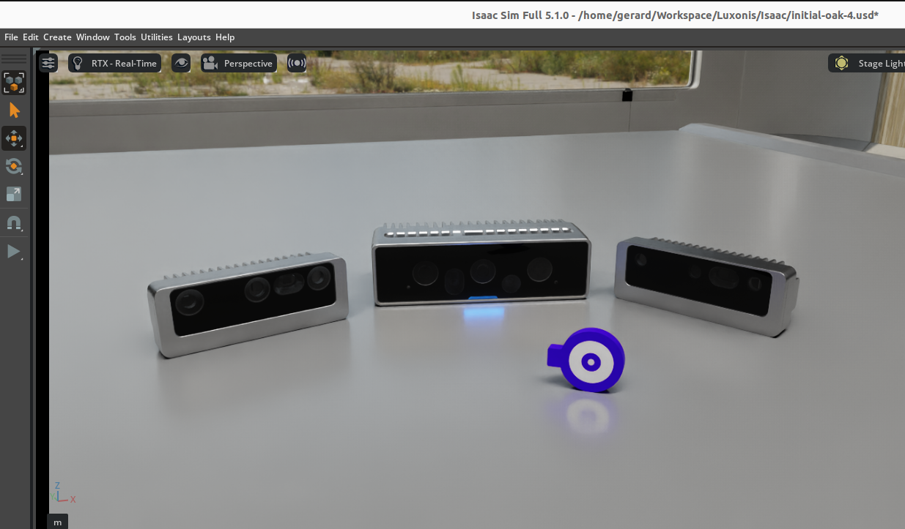
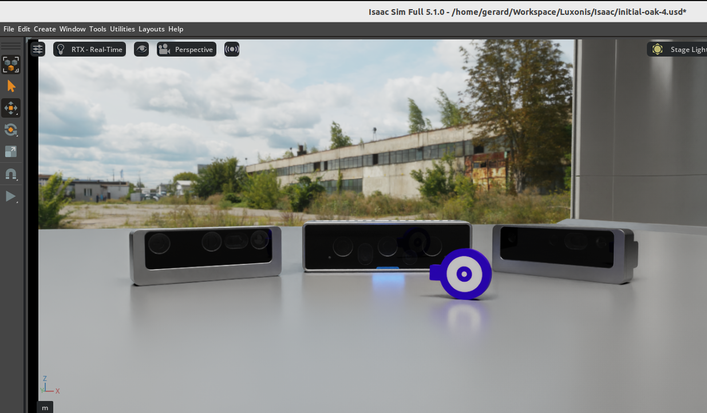


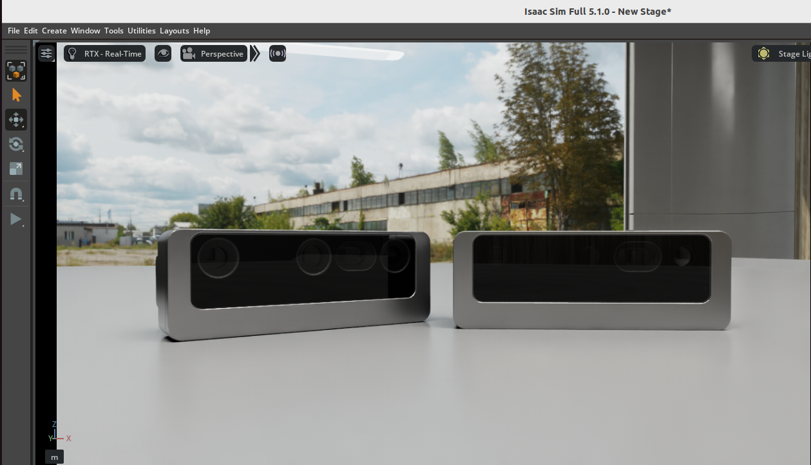
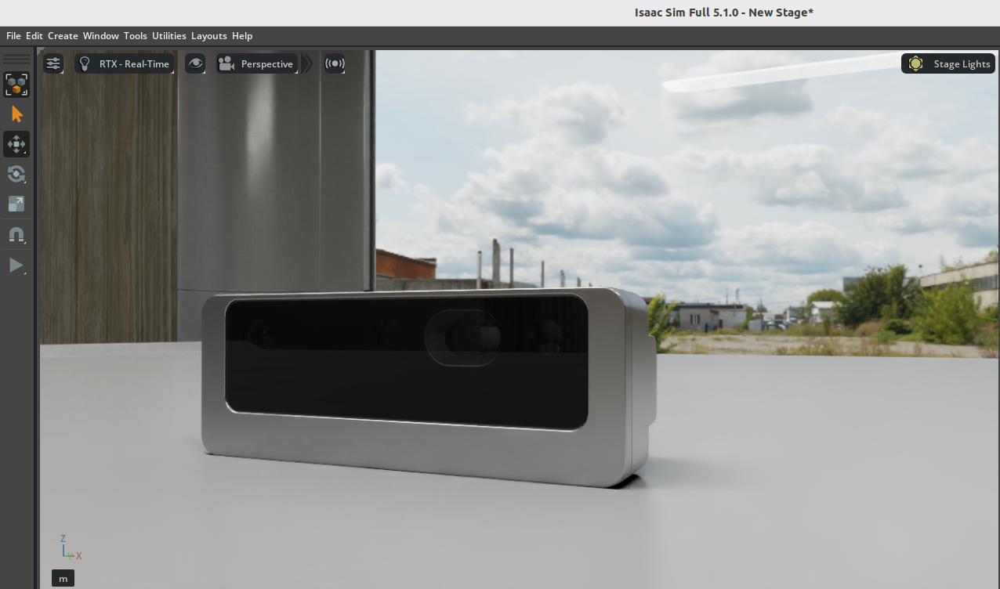

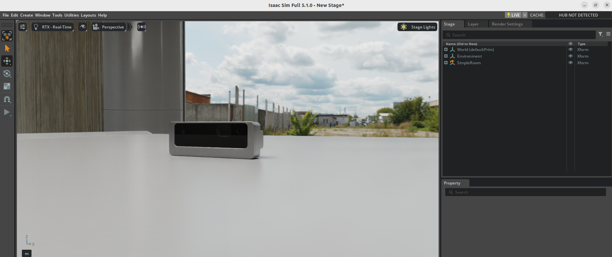


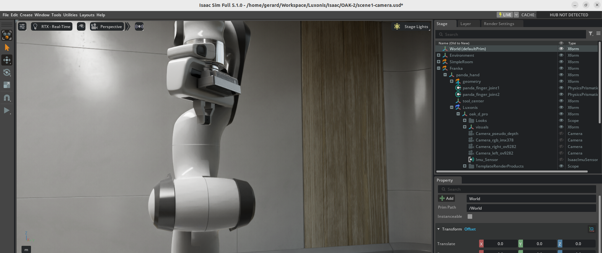
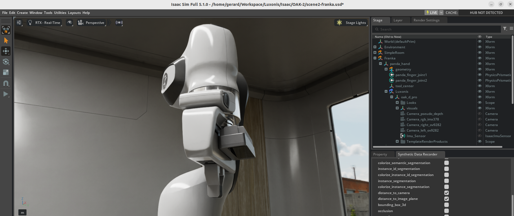
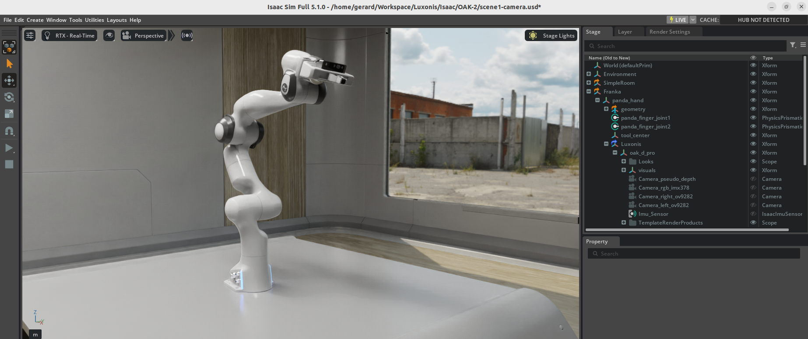

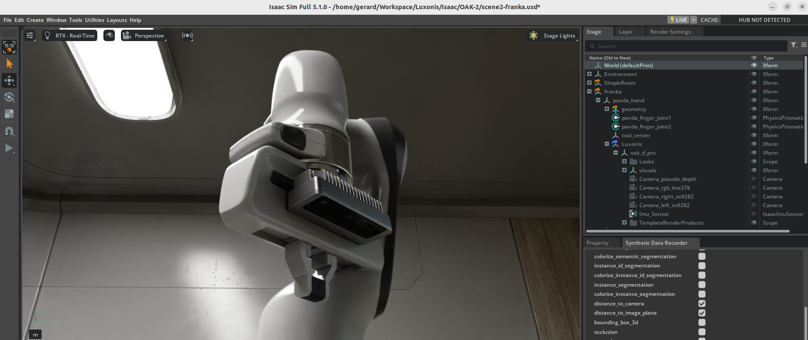


<video src="media/oak-franka-vid1.mp4" controls width="600"></video>
